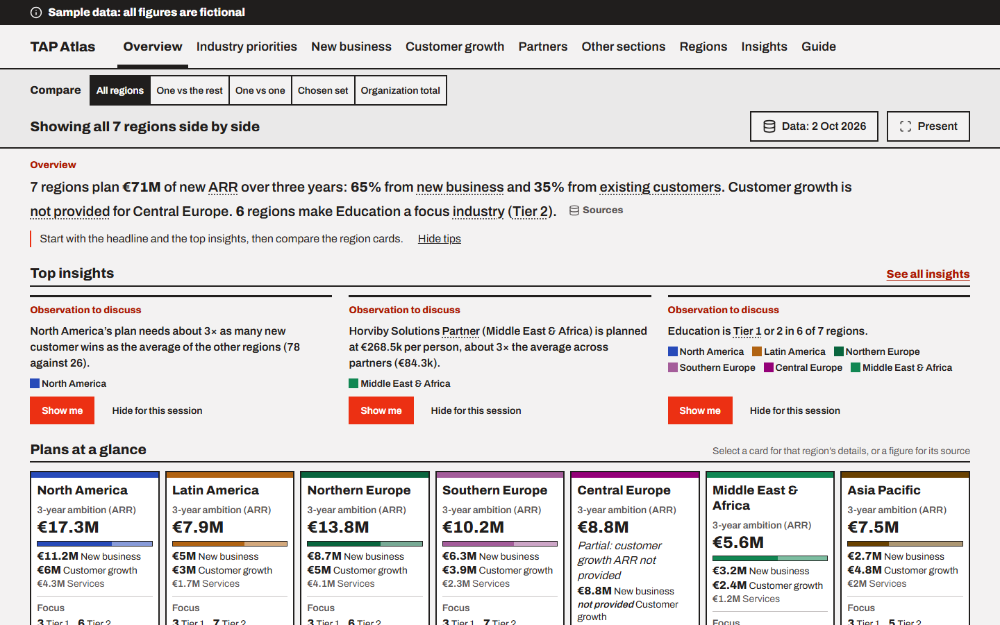
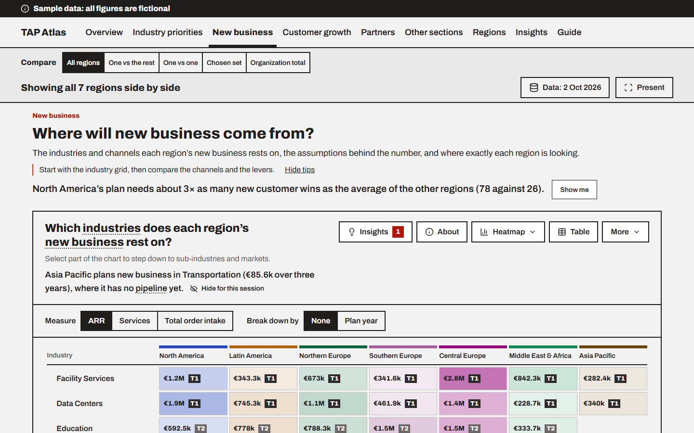

# Case study: TAP Atlas

How a small browser app for comparing regional plans was planned and built in three phases over four days, with user stories, a traced test plan, numbered decisions and parallel build agents.

Generic and fictional throughout: no organization, person or customer is named, and every figure and screenshot comes from the invented sample data.

## The brief

Every regional leader fills in the same territory account planning workbook: which industries matter and how much, where new business will come from, how existing customers will grow, and which partners carry the plan. Leadership reviews the plans together, over a shared screen. Read one workbook at a time, the plans were hard to compare: totals were worked out differently, and the differences worth discussing were lost in the cells.

The job: one place that plays each region's plan back, compares regions on the same terms, and points out what is worth discussing, with every figure traceable to its cell. It had to be ready for a first leadership demo within days, and then be maintained by a non-developer with a chat assistant (Microsoft 365 Copilot) (D10).

## The constraints

- **No server.** The app is a folder opened by double-click in Chrome or Edge: plain HTML, CSS and JavaScript, classic scripts, no build step, no install and no web requests. The chart library (Apache ECharts) and the fonts are stored in the folder (D6, D7, D19).
- **A shared screen.** It is presented over a video call from a laptop: body text at least 16 px, chart labels at least 13 px, at most two panels side by side, nothing that only shows on hover, no animation, and never colour alone. It must work at 1280 and 1920 px wide and at 125% and 150% zoom (D24). The region palette was checked with a colour-blindness simulation and adjusted (D45).
- **A data boundary.** The real plans are confidential. They are read only by the organization's approved AI assistant, which builds and runs the import; the build itself only ever saw fictional data (D1, D27). One documented file shape, the Data Contract, is the only interface between the plans and the app (D11, D28).
- **A public repository.** The code is public as a portfolio piece, so it holds only generic wording and generated sample data. Real data and organization wording live in gitignored files in an internal copy, and a scan blocks any organization term from being committed (D2, D33, D37).

## Key decisions

74 decisions were logged, each with the date, the reasons and the alternatives. The ones that shaped the app most:

| Decision | What was decided | Why |
|---|---|---|
| D5 | Show the workbook's finished values; never re-implement its planning model | Recalculated figures could disagree with what leaders saw in their own workbooks |
| D6, D7 | A browser-only app distributed as a folder | No hosting, no install, and it works on any laptop |
| D11, D28 | A repeatable import into one data file, checked against the contract when the app opens | Problems surface as a plain, copyable list instead of broken charts |
| D18 | A configurable report engine: reports are definitions, not code | A new report of an existing shape needs no chart code, so it can be added through a chat assistant |
| D20, D25 | Insights are transparent rules, shown with their figures and their rule | Leaders can see why something was flagged; nothing is a black box |
| D26 | Every figure traces back to file, sheet and cell | Trust: any number on screen can be checked against its source |
| D29 | Sample data generated by a script, with planted cases | Every insight rule has a known case to find, and the tests have exact expected values |
| D30 | Testing lives inside every story, plus a quality epic | Every acceptance criterion has a recorded test case before any code is written |
| D31, D32 | User experience and visual design delegated to a design assistant, then reviewed | A full design of every view in hours; stories still win over the design |
| D44 | A parallel build in waves, with contracts fixed first and fixed file ownership | Several agents can build at once without stepping on each other |
| D48 | Missing values in three states: zero, not provided, not applicable | A blank cell is never shown as zero |
| D57 | `v0.1.0` stays the demo and handover build; the Data Contract only grows, and additions never change its version | An import built for the first demo keeps working through later phases |
| D59, D67 | The portfolio edition is built in the repository but not published | Publishing is the project owner's call |
| D65, D66, D68 | Running order in configuration; unknown template sections as optional extra sections; custom charts limited by measure metadata | Repeatable demos, no guessing at the real template, and no misleading charts such as summed rates |

## The delivery method

1. **Stories first.** Each epic was broken into user stories with acceptance criteria, reviewed and locked before any build. From Phase 2 on, the project owner delegated drafting and asked to be consulted only on critical calls (D56); every default taken was logged as a decision.
2. **Issues and a board.** Every epic and story became a GitHub issue, stories as sub-issues of their epics, with milestones per phase and a project board (D34).
3. **A traced test plan.** Every acceptance criterion maps to at least one test case: automated (run on the test page), manual (done in the app) or review (an inspection of a document). Writing the cases before the code was itself a review: it found a contradiction between two stories before anything was built.
4. **Contracts, then waves.** A lead wrote the architecture contracts and a skeleton with every module stubbed. Build streams then worked in parallel, each in its own git worktree, owning a fixed set of files, writing tests first and coding against the contracts.
5. **Checks on every change.** A single script runs lint (house rules, file size, no web calls, no stray colours), the denylist scan, a docs paths check and the full test page headless in both browsers. CI runs on every pull request, and every pull request had an independent review (one slip, below) and a rebase merge. Reviews of the numbers work recalculated figures by hand and caught real defects before merge, such as a weight typo that dropped every region and a tier measure that counted a missing industry as zero.
6. **Logs and releases.** Every prompt and every decision was logged as the work went. Each phase ended with a release gate (stricter checks, the QA scripts for console errors, text sizes, offline use and a smoke test) and a tagged release (D58).

## What each phase delivered

| Phase | Delivered | Stories | Test cases | Checks at release |
|---|---|---|---|---|
| 1, `v0.1.0` | The app shell and the comparison bar, the report panel and engine, sample data with planted cases, the Overview and Industry priorities views, insights in six rule families, the Guide, glossary and tour, the contract check, and the handover documents for the import | 58 (49 Must, 9 Should) | 270 | 635 automated checks pass in Chrome and Edge; the QA smoke run of 281 steps with no exceptions |
| 2, `v0.2.0` | The New business, Customer growth and Partners views, the region profile, list reports, drill-down, a dot plot and breakdowns, three more insight families, and reading tips | 37 (22 Must, 13 Should, 2 Could) | 245 | 969 automated checks pass in Chrome and Edge; the QA smoke run of 724 steps per browser with no exceptions |
| 3, `v0.3.0` | Presentation mode with a running order, custom charts, extra template sections, the handover pack, and this portfolio edition | 18 (10 Must, 7 Should, 1 Could) | 118 | 1,079 automated checks pass in Chrome and Edge; QA scripts on every view: no console errors, nothing below 13 px, no web requests; smoke test with no failures |

In total: 113 stories, 633 test cases and 74 decisions, built in four days. About 110 pull requests were merged in Phase 1, about 60 in Phase 2 and about 25 in Phase 3.

## What worked, and what was learned

- **Contracts before code.** Fixed interfaces and file ownership let five agents build in parallel with few conflicts. When a contract didn't fit, the rule was to stop and propose a change, not to work around it.
- **Planted cases.** Because the sample data is generated with known cases, an insight rule's test checks against the planted answer, never against what the code produced.
- **Process safeguards.** One pull request was merged before its review, through a mistyped number; it was reviewed straight after and kept. That slip led to a helper that checks the branch and CI before merging; a branch clean-up that removed an agent's work led to the rule that only one's own temporary branches are deleted.
- **Check where a design comes from.** The design assistant's style looked like a house brand; it turned out to be the project owner's own working style, which was fine, but it was checked before being treated as generic.

## See it

[Open the sample edition](../index-sample.html) (`index-sample.html`), or read [the handover guide](HANDOVER.md) (`docs/HANDOVER.md`) for how the app is run and maintained.
